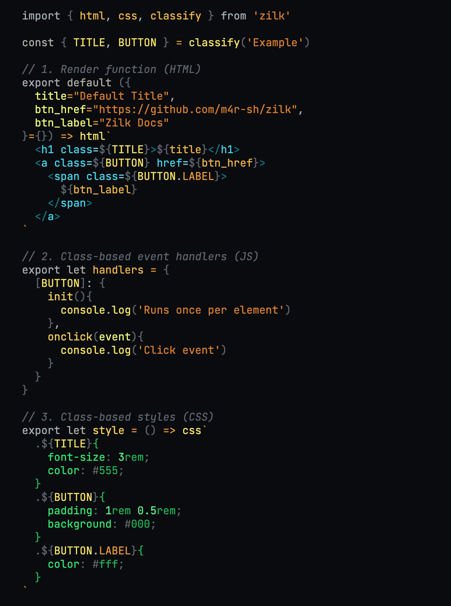

  

<h1 align="center">zilk</h1>

lightweight web framework

 

  <a href="https://m4rsh.com/argiope">
    Blog
  </a>
  •
  <a href="https://npmjs.org/package/zilk">
    NPM
  </a>

 

---

## Motivation

zilk is designed for authoring isomorphic web components (just like React, Svelte, Vue, etc).

*So what's different?*

UI components are defined **in pure javascript** with **colocated definitions**.

zilk is not feature-rich. Instead of learning new API's and syntax, it should feel like writing vanilla HTML, CSS, and JavaScript. No JSX, no DSL's: *just tagged template literals*.

## How it works

zilk was designed in tandem with zilker.

zilk provides the runtime utilities for isomorphic rendering, scoped classnames, ssr routing, hydration, and client-side navigation.

zilker is the recommended build tool for transforming zilk components into complete webpages with all of the necessary output files.

By separting handlers, styles, markup, and markdown into different exported functions, we can see all of the behavior in one file, while our build process can extract each export as needed.

---

## Example

highlighting by [argiope](https://github.com/m4r-sh/argiope) (a plugin built specifically for working with zilk)

---

## Credits

The performance of `zilk` is largely due to [@WebReflection's](https://github.com/WebReflection/) incredible work on [`uhtml`](https://github.com/WebReflection/uhtml), [`wicked-elements`](https://github.com/WebReflection/wicked-elements), and other top-tier JS libraries.

Credit to [`navaid`](https://github.com/lukeed/navaid/) for simple client-side navigation logic, and to [`itty-router`](https://itty.dev/itty-router) for minimal route matching.
